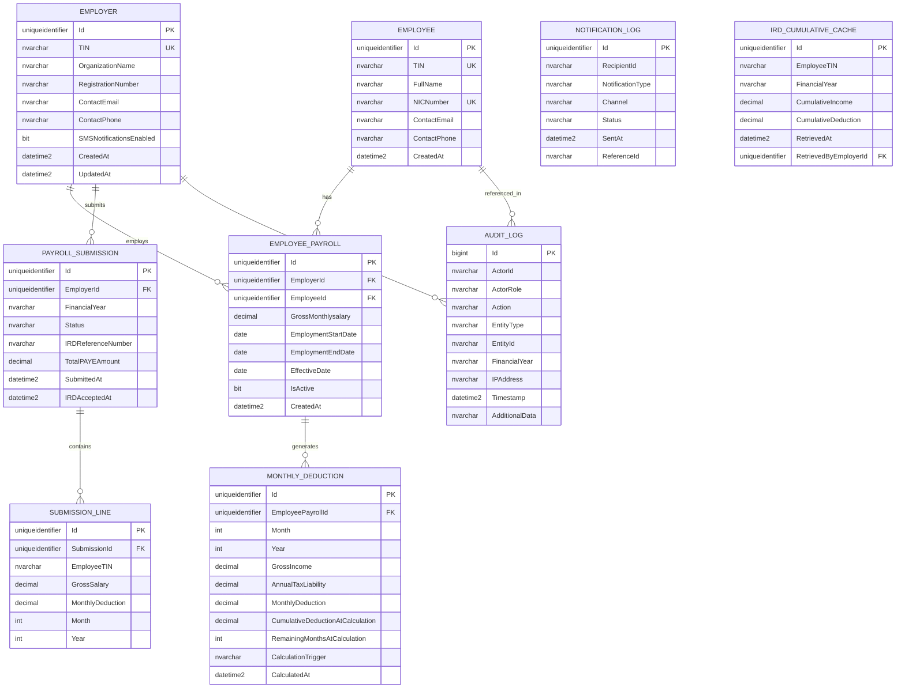

# Design Document: PAYE Tax Easy

## Overview

PAYE Tax Easy is a multi-tenant, cloud-hosted tax management platform built on Microsoft Azure. It solves the mid-year employer-transition problem in Sri Lanka's PAYE system by giving employers real-time access to an employee's cumulative deduction history from the IRD, enabling accurate monthly tax recalculations. The platform serves three distinct user groups — employers/HR, employees, and IRD officers — each with a dedicated portal backed by a shared .NET Core API layer.

The system is designed around a layered architecture:

```
Presentation Layer  →  Application Layer  →  Integration Layer  →  Data Layer
(React Portals)        (.NET Core API)        (IRD / Azure AD)      (SQL Server)
                                ↕
                         Security Layer
                    (Azure AD B2C, Key Vault,
                      TLS 1.2+, AES-256)
```

Key design goals:
- **Correctness**: Tax calculations must be deterministic and auditable.
- **Security**: PII encrypted at rest (AES-256) and in transit (TLS 1.2+).
- **Auditability**: Append-only audit log with 7-year retention.
- **Scalability**: Horizontal auto-scaling on Azure App Service / AKS.

---

## Architecture

### High-Level Component Diagram

```mermaid
graph TD
    subgraph Clients
        EP[Employee Portal\nReact SPA]
        EMP[Employer Portal\nReact SPA]
        IRD_UI[IRD Dashboard\nReact SPA]
    end

    subgraph Azure API Gateway
        GW[API Gateway\nAzure API Management]
    end

    subgraph Backend Services (.NET Core)
        AUTH[Auth_Service]
        CALC[PAYE_Calculator]
        PAY[Payroll_Service]
        IRD_SVC[IRD_Integration_Service]
        EMP_PORTAL[Employee_Portal_Service]
        IRD_DASH[IRD_Dashboard_Service]
        NOTIF[Notification_Service]
        AUDIT[Audit_Service]
    end

    subgraph Data
        DB[(SQL Server\nAzure SQL)]
        KV[Azure Key Vault]
        BLOB[Azure Blob Storage\nPDF / Backups]
    end

    subgraph External
        AAD[Azure AD B2C]
        IRD_API[IRD Secure API\nOAuth 2.0]
        EMAIL[SendGrid / SMTP]
        SMS[Twilio / SMS Gateway]
    end

    EP --> GW
    EMP --> GW
    IRD_UI --> GW
    GW --> AUTH
    GW --> PAY
    GW --> EMP_PORTAL
    GW --> IRD_DASH
    AUTH --> AAD
    PAY --> CALC
    PAY --> IRD_SVC
    PAY --> AUDIT
    IRD_SVC --> IRD_API
    EMP_PORTAL --> AUDIT
    IRD_DASH --> AUDIT
    NOTIF --> EMAIL
    NOTIF --> SMS
    AUTH --> KV
    CALC --> DB
    PAY --> DB
    EMP_PORTAL --> DB
    IRD_DASH --> DB
    AUDIT --> DB
    EMP_PORTAL --> BLOB
```

### Deployment Architecture

All services are deployed to **Azure App Service** (or AKS for containerised workloads) behind **Azure API Management**. Azure Front Door provides global load balancing and WAF protection. SQL Server runs on **Azure SQL Database** (Business Critical tier) with geo-redundant backups. Secrets are stored exclusively in **Azure Key Vault**.

---

## Components and Interfaces

### Auth_Service

Wraps Azure AD B2C. Responsible for:
- Issuing and validating JWT access tokens (RS256).
- Enforcing RBAC roles: `Employer`, `Employee`, `IRD_Officer`, `SystemAdmin`.
- Account lockout after 5 failed attempts within 15 minutes.
- Session timeout after 30 minutes of inactivity.
- MFA enforcement per account policy.

**Key Interfaces:**

```
POST /auth/login          → { accessToken, refreshToken, expiresIn }
POST /auth/refresh        → { accessToken, expiresIn }
POST /auth/logout         → 204 No Content
POST /auth/register       → { userId, status }
GET  /auth/me             → { userId, role, organizationId }
```

### PAYE_Calculator

A pure, stateless computation service (no direct DB access). Accepts income and deduction parameters and returns tax figures. This isolation makes it independently testable.

**Key Interfaces (internal service calls):**

```csharp
TaxResult CalculateAnnualTax(decimal annualIncome);
MonthlyDeductionResult CalculateMonthlyDeduction(decimal annualIncome);
AdjustedDeductionResult CalculateAdjustedDeduction(
    decimal projectedAnnualIncome,
    decimal cumulativeDeduction,
    int remainingMonths);
```

### Payroll_Service

Manages salary records, payroll submissions, and deduction history per employer.

**Key REST Endpoints:**

```
POST /payroll/employees/{tin}/salary          → SalaryRecord
GET  /payroll/employees/{tin}/salary          → SalaryRecord[]
POST /payroll/submissions                     → SubmissionResult
GET  /payroll/submissions/{id}                → PayrollSubmission
GET  /payroll/summary/{period}                → DeductionSummary[]
PUT  /payroll/employees/{tin}/salary/{id}     → SalaryRecord (correction)
POST /payroll/submissions/bulk                → BulkSubmissionResult
```

### IRD_Integration_Service

Handles all outbound communication with the IRD's API. Uses OAuth 2.0 client credentials (stored in Key Vault). Implements retry with exponential back-off and circuit breaker.

**Key Interfaces:**

```
GET /ird/cumulative/{tin}/{financialYear}     → CumulativeData
POST /ird/submit/{submissionId}              → IRDSubmissionAck
```

### Employee_Portal_Service

Read-only service for employees. Returns deduction history and generates PDF exports.

```
GET  /employee/history/{financialYear}       → DeductionHistory
GET  /employee/history/{financialYear}/pdf   → PDF (binary stream)
```

### IRD_Dashboard_Service

Read-only service for IRD officers. Generates compliance reports.

```
GET  /ird-dashboard/compliance/{financialYear}          → ComplianceReport
GET  /ird-dashboard/compliance/{financialYear}/export   → PDF/CSV
GET  /ird-dashboard/employers/{registrationNo}          → EmployerDetail
GET  /ird-dashboard/audit-logs                          → AuditLogPage
```

### Notification_Service

Asynchronous service triggered via Azure Service Bus messages. Sends email (SendGrid) and SMS (Twilio).

```
Event: PayrollSubmissionAccepted  → email + optional SMS
Event: PayrollSubmissionFailed    → email + optional SMS
Event: FilingDeadlineReminder     → email (7 days before 30 Nov)
Event: MaintenanceWindow          → email to all registered users
```

### Audit_Service

Append-only log writer. All services call `AuditService.Record(AuditEntry)`. No update or delete operations are exposed.

---

## Data Models

### Entity Relationship Diagram



### Key Data Notes

- `TIN`, `NICNumber`, `GrossMonthlysalary`, `CumulativeIncome`, `CumulativeDeduction` are stored **AES-256 encrypted** at the column level using Always Encrypted (Azure SQL).
- `AUDIT_LOG` uses a `bigint` identity PK (append-only; no FK cascade deletes).
- `IRD_CUMULATIVE_CACHE` stores a point-in-time snapshot of IRD data; it is never updated — new retrievals insert new rows.
- `MONTHLY_DEDUCTION.CalculationTrigger` records the reason: `InitialEntry`, `SalaryAdjustment`, `IRDDataRetrieved`, `ManualCorrection`.

---

## API Design

### Authentication Flow

All API calls require a Bearer JWT issued by Azure AD B2C. The API Gateway validates the token signature and forwards claims to downstream services.

```
Client → POST /auth/login (credentials)
       ← { accessToken (JWT, 1h), refreshToken (opaque, 24h) }

Client → GET /payroll/summary/2024-25
         Authorization: Bearer <accessToken>
       ← DeductionSummary[]
```

### Key Request/Response Schemas

#### POST /payroll/employees/{tin}/salary

Request:
```json
{
  "grossMonthlySalary": 350000,
  "employmentStartDate": "2024-08-01",
  "financialYear": "2024-25"
}
```

Response:
```json
{
  "salaryRecordId": "uuid",
  "employeeTIN": "123456789V",
  "grossMonthlySalary": 350000,
  "annualTaxLiability": 216000,
  "monthlyDeduction": 18000,
  "effectiveDate": "2024-08-01",
  "financialYear": "2024-25"
}
```

#### GET /ird/cumulative/{tin}/{financialYear}

Response:
```json
{
  "employeeTIN": "123456789V",
  "financialYear": "2024-25",
  "cumulativeIncome": 1400000,
  "cumulativeDeduction": 0,
  "retrievedAt": "2024-08-15T10:30:00Z",
  "source": "IRD"
}
```

#### POST /payroll/submissions (PAYE Return Filing)

Request:
```json
{
  "financialYear": "2024-25",
  "period": "2024-08",
  "lines": [
    {
      "employeeTIN": "123456789V",
      "grossSalary": 350000,
      "monthlyDeduction": 18000
    }
  ]
}
```

Response:
```json
{
  "submissionId": "uuid",
  "irdReferenceNumber": "IRD-2024-08-00123",
  "status": "Accepted",
  "totalPAYEAmount": 18000,
  "submittedAt": "2024-08-31T14:00:00Z"
}
```

### Error Response Format

All errors follow a consistent envelope:

```json
{
  "errorCode": "PAYROLL_001",
  "message": "Gross monthly salary must be a positive value in Sri Lankan Rupees.",
  "field": "grossMonthlySalary",
  "suggestedAction": "Enter a numeric value greater than 0.",
  "traceId": "abc-123"
}
```

---

## Security Design

### Authentication and Authorization

| Layer | Mechanism |
|---|---|
| Identity Provider | Azure AD B2C (OIDC / OAuth 2.0) |
| Token Format | JWT (RS256, 1-hour expiry) |
| Refresh | Opaque refresh token (24-hour, rotated on use) |
| MFA | TOTP / SMS OTP via Azure AD B2C policy |
| RBAC Roles | `Employer`, `Employee`, `IRD_Officer`, `SystemAdmin` |
| API Gateway | Token validation + rate limiting (100 req/min per client) |

### Data Encryption

| Data State | Standard |
|---|---|
| At rest (PII columns) | AES-256 via SQL Always Encrypted |
| At rest (backups) | AES-256, Azure Backup encryption |
| In transit | TLS 1.2+ (TLS 1.3 preferred) |
| Key management | Azure Key Vault (HSM-backed), rotation ≤ 12 months |

### Audit and Immutability

- `AUDIT_LOG` table has no `UPDATE` or `DELETE` permissions granted to any application role.
- A database trigger raises an alert and writes to a separate `SECURITY_ALERT_LOG` if a DDL or DML modification is attempted on `AUDIT_LOG`.
- Logs are replicated to Azure Blob Storage (immutable blob storage with legal hold) for 7-year retention.

### Network Security

- All services run inside an Azure Virtual Network (VNet).
- SQL Server is not publicly accessible; only the API layer has inbound rules.
- Azure Front Door WAF blocks OWASP Top 10 attack patterns.
- IRD API calls originate from a static outbound IP (NAT Gateway) whitelisted by the IRD.

---

## Key Algorithms

### Tax Slab Calculation

```csharp
public static decimal CalculateAnnualTax(decimal annualIncome)
{
    if (annualIncome <= 0) return 0m;

    decimal tax = 0m;
    decimal taxableIncome = Math.Max(0m, annualIncome - 1_800_000m); // apply relief

    // Slab 1: 6% on 1,800,001 – 2,800,000 (max Rs. 1,000,000 in this band)
    decimal slab1 = Math.Min(taxableIncome, 1_000_000m);
    tax += slab1 * 0.06m;
    taxableIncome -= slab1;
    if (taxableIncome <= 0) return tax;

    // Slab 2: 18% on 2,800,001 – 3,300,000 (max Rs. 500,000)
    decimal slab2 = Math.Min(taxableIncome, 500_000m);
    tax += slab2 * 0.18m;
    taxableIncome -= slab2;
    if (taxableIncome <= 0) return tax;

    // Slab 3: 24% on 3,300,001 – 3,800,000 (max Rs. 500,000)
    decimal slab3 = Math.Min(taxableIncome, 500_000m);
    tax += slab3 * 0.24m;
    taxableIncome -= slab3;
    if (taxableIncome <= 0) return tax;

    // Slab 4: 30% on 3,800,001 – 4,300,000 (max Rs. 500,000)
    decimal slab4 = Math.Min(taxableIncome, 500_000m);
    tax += slab4 * 0.30m;
    taxableIncome -= slab4;
    if (taxableIncome <= 0) return tax;

    // Slab 5: 36% on income above 4,300,000
    tax += taxableIncome * 0.36m;

    return tax;
}
```

**Verification against stated cumulative amounts:**
- At Rs. 2,800,000: tax = 1,000,000 × 6% = Rs. 60,000 ✓
- At Rs. 3,300,000: Rs. 60,000 + 500,000 × 18% = Rs. 150,000 ✓
- At Rs. 3,800,000: Rs. 150,000 + 500,000 × 24% = Rs. 270,000 ✓
- At Rs. 4,300,000: Rs. 270,000 + 500,000 × 30% = Rs. 420,000 ✓

### Monthly Deduction (Standard)

```
MonthlyDeduction = Round(CalculateAnnualTax(GrossMonthly × 12) / 12, 0)
```

### Adjusted Monthly Deduction (Mid-Year Transition)

```
ProjectedAnnualIncome = CumulativeIncome + (CurrentMonthlyGross × RemainingMonths)
AnnualTaxOnProjected  = CalculateAnnualTax(ProjectedAnnualIncome)
AdjustedMonthly       = Max(0, Round((AnnualTaxOnProjected − CumulativeDeduction) / RemainingMonths, 0))
```

Where `RemainingMonths` = months from the current month to 31st March (inclusive).

If `AdjustedMonthly < 0`, set to `0` and flag the record (`IsOverpaid = true`).

### Employment Gap Handling

When an employee has zero-income months, those months are excluded from `RemainingMonths`:

```
ActiveRemainingMonths = RemainingMonths − ZeroIncomeMonths
AdjustedMonthly = Max(0, Round((AnnualTaxOnProjected − CumulativeDeduction) / ActiveRemainingMonths, 0))
```

### Simultaneous Employers

Each employer calculates their proportional share:

```
EmployerShare(i) = EmployerMonthlyGross(i) / TotalMonthlyGross
AdjustedMonthly(i) = AdjustedMonthly_Total × EmployerShare(i)
```

---

## Correctness Properties

*A property is a characteristic or behavior that should hold true across all valid executions of a system — essentially, a formal statement about what the system should do. Properties serve as the bridge between human-readable specifications and machine-verifiable correctness guarantees.*


### Property 1: Slab Calculation Correctness

*For any* non-negative annual income, the `CalculateAnnualTax` function SHALL return a value that exactly matches the progressive slab formula defined in the Inland Revenue Amendment Act No. 02 of 2025 — specifically: 0% on the first Rs. 1,800,000; 6% on the next Rs. 1,000,000; 18% on the next Rs. 500,000; 24% on the next Rs. 500,000; 30% on the next Rs. 500,000; and 36% on any remainder.

**Validates: Requirements 4.1, 4.2, 4.3**

---

### Property 2: Monthly Deduction Round-Trip

*For any* valid annual income, the sum of the 12 monthly PAYE deductions computed for that income SHALL equal the annual PAYE tax liability within a rounding tolerance of ±12 Sri Lankan Rupees (one rupee per month of rounding).

**Validates: Requirements 4.4, 4.6**

---

### Property 3: Adjustment Formula Correctness

*For any* valid combination of projected annual income, cumulative deduction already paid, and number of remaining months in the financial year (where remaining months ≥ 1), the adjusted monthly deduction SHALL equal `Max(0, Round((CalculateAnnualTax(projectedAnnualIncome) − cumulativeDeduction) / remainingMonths, 0))`.

**Validates: Requirements 4.5, 6.1, 6.2**

---

### Property 4: Non-Negative Deduction Invariant

*For any* inputs to the adjustment formula where the cumulative deduction already paid equals or exceeds the annual tax liability on the projected annual income, the adjusted monthly deduction SHALL be Rs. 0 (never negative).

**Validates: Requirements 6.3, 15.5**

---

### Property 5: Employment Gap Month Exclusion

*For any* employee with a set of active employment months and one or more zero-income months within the financial year, the adjusted monthly deduction SHALL be computed by dividing the remaining tax liability only by the count of active (non-zero-income) remaining months, not the total calendar months remaining.

**Validates: Requirements 15.2**

---

### Property 6: Dual-Employer Proportional Distribution

*For any* employee working simultaneously for two employers with monthly gross salaries `s1` and `s2`, the sum of the adjusted monthly deductions assigned to each employer individually SHALL equal the adjusted monthly deduction that would be computed on the combined income `s1 + s2` — i.e., `deduction(s1, s1+s2) + deduction(s2, s1+s2) = deduction(s1+s2)`.

**Validates: Requirements 15.6**

---

### Property 7: Audit Log Immutability

*For any* audit log entry that has been successfully written to the system, any attempt to update or delete that entry SHALL be rejected by the data store, and a security alert SHALL be raised in the security log.

**Validates: Requirements 13.4, 13.5**

---

## Error Handling

### Error Categories and Codes

| Code | Category | Description | HTTP Status |
|---|---|---|---|
| AUTH_001 | Authentication | Invalid credentials | 401 |
| AUTH_002 | Authentication | Account locked | 423 |
| AUTH_003 | Authentication | Session expired | 401 |
| AUTH_004 | Authorization | Insufficient role | 403 |
| PAYROLL_001 | Validation | Invalid salary value | 422 |
| PAYROLL_002 | Validation | Unknown employee TIN | 422 |
| PAYROLL_003 | Validation | Submission deadline passed | 422 |
| PAYROLL_004 | Business | Payroll period locked | 409 |
| IRD_001 | Integration | IRD API unavailable | 503 |
| IRD_002 | Integration | No prior records found | 200 (empty) |
| IRD_003 | Integration | IRD validation failure | 422 |
| CALC_001 | Calculation | Negative income | 422 |
| CALC_002 | Calculation | Invalid remaining months | 422 |
| SYS_001 | System | Internal server error | 500 |

### Resilience Patterns

- **IRD API**: Retry with exponential back-off (3 attempts: 1s, 2s, 4s), then circuit breaker (open for 60s). On circuit open, return `IRD_001` with `retryAfter` header.
- **Database**: Connection pool with health checks; read replicas for reporting queries.
- **Notification delivery**: Azure Service Bus dead-letter queue for failed notifications; retry up to 5 times over 24 hours.
- **PDF generation**: Timeout after 10 seconds; return `SYS_001` with a retry suggestion.

### Validation Rules

- `grossMonthlySalary`: must be `> 0`, numeric, max 15 digits.
- `employmentStartDate`: must be within the current or previous financial year.
- `remainingMonths`: must be between 1 and 12 inclusive.
- `TIN`: must match IRD format (9 digits + check character).
- `financialYear`: must match pattern `YYYY-YY` (e.g., `2024-25`).

---

## Testing Strategy

### Dual Testing Approach

The testing strategy combines **unit/example-based tests** for specific scenarios and **property-based tests** for universal correctness of the PAYE_Calculator.

### Property-Based Testing

The `PAYE_Calculator` is a pure, stateless function — the ideal candidate for property-based testing. The chosen PBT library is **FsCheck** (for C# / .NET), which integrates with xUnit.

Each property test runs a **minimum of 100 iterations** with randomly generated inputs.

**Tag format for each test:**
```
// Feature: paye-tax-easy, Property {N}: {property_text}
```

| Property | Test Description | Generator |
|---|---|---|
| P1: Slab Correctness | Verify `CalculateAnnualTax` against reference formula | `Gen.Choose(0, 10_000_000)` mapped to `decimal` |
| P2: Round-Trip | Sum of 12 monthly deductions ≈ annual tax | Same as P1 |
| P3: Adjustment Formula | Adjusted deduction matches formula | `(income, cumDed, months)` triple generator |
| P4: Non-Negative | Adjusted deduction ≥ 0 when overpaid | Generator with `cumDed > annualTax` |
| P5: Gap Exclusion | Active months used as denominator | `(income, cumDed, totalMonths, zeroMonths)` |
| P6: Dual Employer | Sum of proportional deductions = total | `(s1, s2, cumDed, months)` generator |
| P7: Audit Immutability | Update/delete on audit log rejected | Random `AuditEntry` generator |

### Unit / Example-Based Tests

- **Auth_Service**: Login success/failure, lockout after 5 attempts, session timeout, MFA flow.
- **Payroll_Service**: Salary submission validation, correction workflow, period locking.
- **IRD_Integration_Service**: Successful retrieval, API unavailable (mock), no-records response.
- **Notification_Service**: Email sent on submission accepted, SMS when configured, deadline reminder.
- **Employee_Portal_Service**: History display, PDF generation, access control (employee can only see own data).
- **IRD_Dashboard_Service**: Compliance report generation, audit log query, export.

### Integration Tests

- End-to-end payroll submission flow (employer login → salary entry → IRD retrieval → adjustment → submission → notification).
- Audit log written for each action type.
- IRD API circuit breaker behaviour under simulated outage.

### Performance Tests

- 1,000 concurrent users submitting payroll: API response time < 3 seconds for 95th percentile (Azure Load Testing).
- Bulk submission of 500 employees: response within 15 seconds.

### Security Tests

- OWASP ZAP scan on all public endpoints.
- Verify AES-256 encryption on PII columns (attempt direct DB read without Always Encrypted keys).
- Verify audit log immutability (attempt SQL UPDATE on `AUDIT_LOG`; expect rejection).
- Token expiry and refresh flow.
